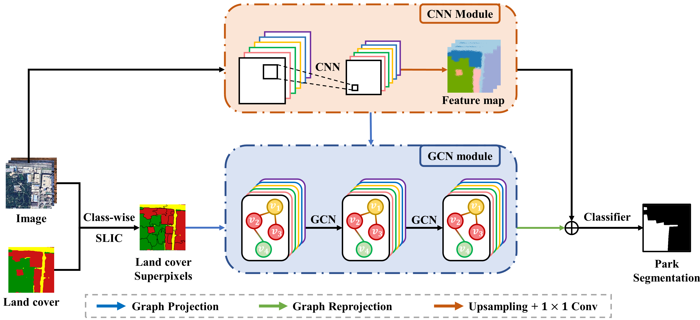

# CHeGCN

Implementation for: [CHeGCN (**C**NN-enhanced **He**tergeneous **G**raph **C**onvolutional **N**etworks)]()




## Software

package installation

```sh
pip install -r ./requirements.txt
```


## Train & Evaluate

`train models`

```sh
# HoGCN
python main.py train --train=True --dataset=datasetHeGCN --model=HoGCN --tag=HoGCN-1

# HeGCN
python main.py train --train=True --dataset=datasetHeGCN --model=HeGCN --tag=HeGCN-1

# CHoGCN
python main.py train --train=True --dataset=datasetCHeGCN --model=CHeGCN --isGCNLabel=False --tag=CHoGCN-1

# CHeGCN
python main.py train --train=True --dataset=datasetCHeGCN --model=CHeGCN --isGCNLabel=True --tag=CHeGCN-1
```


`test models`
You may need to select the best model based on the validation OA curve and set the `testModel`, the `epochs_90.pth` is just an example.
```sh
# HoGCN
python main.py test --dataset=datasetHeGCN --model=HoGCN --tag=HoGCN-1 --testModel=epochs_90.pth

# HeGCN
python main.py test --dataset=datasetHeGCN --model=HeGCN --tag=HeGCN-1 --testModel=epochs_90.pth

# CHoGCN
python main.py test --dataset=datasetCHeGCN --model=CHeGCN --isGCNLabel=False --tag=CHoGCN-1 --testModel=epochs_90.pth

# CHeGCN
python main.py test --dataset=datasetCHeGCN --model=CHeGCN --isGCNLabel=True --tag=CHeGCN-1 --testModel=epochs_90.pth
```


## Best Model

We provide the best model in `./outputs/CHeGCN/checkpoints/epochs_70.pth`

The visualization results of the 3-layer CHeGCN in our paper can be reproduced by the following command:

> the segmentation parameters `n=50,c=10`.

```sh
python main.py test --dataset=datasetCHeGCN --model=CHeGCN --isGCNLabel=True --tag=CHeGCN --testModel=epochs_70.pth
```


## Dataset

The Beijing dataset and Shenzhen dataset will be made public after this paper is accepted.

The details about this dataset can be found in our [article](placehodler).

`./dataset`

```python
├─divide  # data division
│  │  train.txt  # training
│  │  val.txt  # validation
│  │  test.txt  # test
│  │  
│  └─shp  # dataset distribution
│          
├─img  # images
│  ├─slide  # init images
│  │      
│  └─slideEnhanced  # images after space augmentation (slide window)
│
├─landcover  # land cover
│
├─park  # park label
│
├─npy  # graph data
│  ├─adjacency  # adjacency matrix
│  ├─node  # features of nodes
│  ├─landcover  # node-level land cover map
│  └─park  # node-level park label
│
├─SLICResult  # class-wise segmentation of images by SLIC
│  └─segments
```


### Class-wise SLIC Method

This class-wise SLIC method makes use of image texture to achieve clustering and guarantees that all pixels in each superpixel belong to the same land cover category.


## Citation

```

```


## License

The code and the models are MIT licensed, as found in the LICENSE file.
